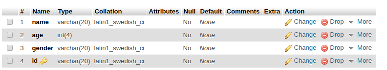
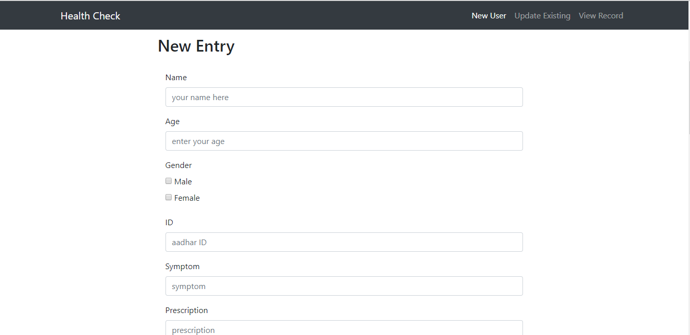
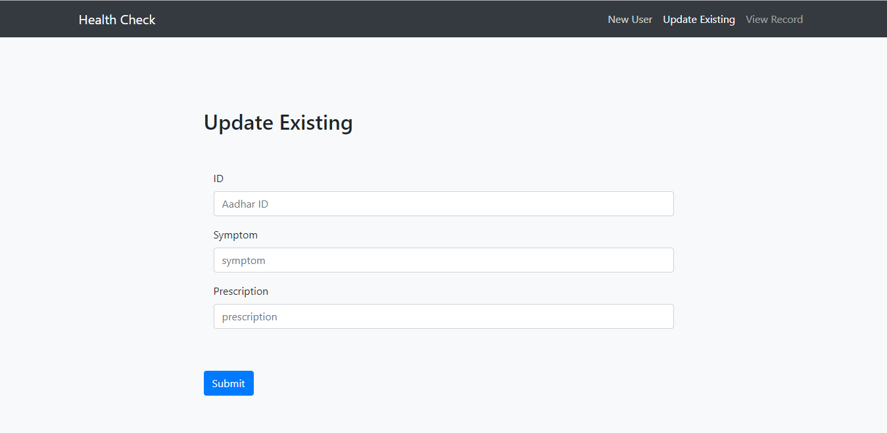

# Health-Check
Health check is the easiest way to provide doctors with up to date information about patient’s medical history. 
It consists of concise data on symptoms and prescribed medicines.
## setup
1. create database - 'health'
2. execute the following query:
> CREATE TABLE `main` (
 `name` varchar(20) NOT NULL,
 `age` int(4) NOT NULL,
 `gender` varchar(20) NOT NULL,
 `id` varchar(20) NOT NULL,
 PRIMARY KEY (`id`)
) ENGINE=InnoDB DEFAULT CHARSET=latin1

3. table structure:

4. run create_table.php (alternative to step 2) to create the table automatically 

## workflow
Patient’s information is collected and updated through forms.

1. For a new patient provide the name, age, gender, aadhar id, symptoms and the prescribed medicine.

2. To update an entry provide th aadhar id and make corresponing changes in the patient's information.

3. View a patients record with the hlp of aadhar id.

